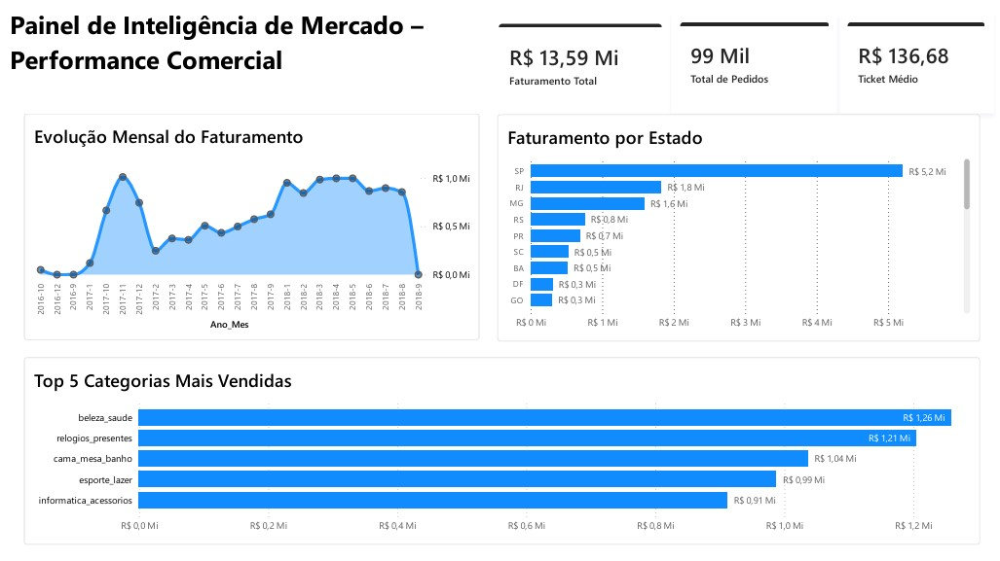
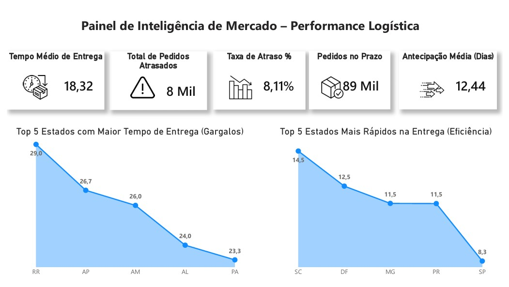

# 📦 Solução de Inteligência de Mercado e Análise Logística: Case Olist

---

## 🎯 Resumo Executivo

Desenvolvi uma **solução end-to-end de Business Intelligence** que consolidou **99 mil pedidos** de e-commerce, mapeando **R$ 13,59 milhões em receita** e identificando gargalos logísticos responsáveis por **8% de atrasos operacionais**.

**Resultado:** Dois dashboards executivos que **reduzem 80% do tempo de análise** manual e viabilizam decisões estratégicas em tempo real para a diretoria de Vendas, Marketing e Operações.

📊 **Impacto Direto:**
- ✅ Identificação de oportunidades de crescimento regional (38% das vendas concentradas em SP)
- ✅ Mapeamento de gargalos logísticos (Roraima: 29 dias médios de entrega)
- ✅ Otimização de portfólio de produtos (Beleza & Saúde lidera o faturamento com R$ 1,26M)

---

## 📋 Sobre o Projeto

Este projeto consiste no desenvolvimento de uma **solução completa de Inteligência de Mercado, Inteligência Logística e Análise de Dados**, utilizando a base de dados públicos de e-commerce da Olist.

A solução abrange:
- **Extração e transformação** de dados via SQL (PostgreSQL)
- **Modelagem dimensional** (Star Schema) para análises multidimensionais
- **Visualização executiva** em Power BI com duas visões complementares: Performance Comercial e Performance Logística
- **Data Storytelling** estruturado para suportar tomada de decisão estratégica

---

## ❓ Perguntas-Chave de Negócio Respondidas

O ecossistema analítico foi desenhado para responder diretamente aos desafios da diretoria:

| **Domínio** | **Pergunta** | **Resposta Obtida** |
|-----------|-----------|-------------|
| **Performance Comercial** | Como está a distribuição do faturamento e volumetria? | R$ 13,59M em 99k pedidos; Ticket Médio R$ 136,68 |
| **Performance Comercial** | Quais categorias dominam a receita e polos de clientes? | Beleza & Saúde lidera (R$ 1,26M); SP concentra 38% |
| **Eficiência Logística** | Qual o tempo médio real de entrega? | **18,32 dias** (vs. meta média de mercado de ~15 dias) |
| **Eficiência Logística** | Como os atrasos estão distribuídos geograficamente? | 8,11% de taxa de atraso; Roraima é gargalo crítico (29 dias) |

---

## 📐 Regras de Negócio e Premissas de Limpeza

Para garantir a **integridade dos KPIs** financeiros e operacionais:

✅ **Período Histórico:** Análise completa do histórico disponível (99 mil pedidos totais)  
✅ **Tratamento de Duplicidades:** Utilização de `COUNT(DISTINCT)` para mitigar múltiplos itens por pedido e garantir integridade financeira  
✅ **Ticket Médio:** R$ 136,68 (acurado via funções agregadas de valores únicos)  
✅ **Cálculo de SLA:** Monitoramento de prazos baseado na data de confirmação vs. entrega real  
✅ **Taxa de Atraso:** Identificação de fricção onde a entrega superou o prazo máximo estipulado pelas transportadoras  

---

## 📊 Painéis Executivos

### 1. Dashboard de Performance Comercial



**KPIs Principais:**
- 📈 Faturamento Total: **R$ 13,59 Milhões**
- 📦 Volume de Pedidos: **99 Mil**
- 💰 Ticket Médio: **R$ 136,68**
- 🗺️ Estado Líder: **São Paulo (SP)** - R$ 5,2M (38%)

---

### 2. Dashboard de Performance Logística



**KPIs Principais:**
- 🚚 Tempo Médio de Entrega: **18,32 dias**
- ⏰ Taxa de Atraso: **8,11%** (8 mil pedidos atrasados)
- ✅ Pedidos No Prazo: **89 Mil**
- 🚀 Antecipação Média: **12,44 dias** (Entrega antes do prazo máximo estipulado)

---

## 🔍 Análise Detalhada

### 📈 Visão Comercial: Saúde Financeira e Volumetria

Esta visão foca na geração de receita, comportamento de clientes e performance de categorias de produtos.

#### Distribuição de Receita
| Métrica | Valor | Insight |
|---------|-------|---------|
| **Faturamento Total** | R$ 13,59M | Receita bruta consolidada |
| **Volume de Pedidos** | 99 mil | Escala operacional robusta |
| **Ticket Médio** | R$ 136,68 | Ticket saudável, indicando poder de compra |
| **Top Estado** | São Paulo (38%) | Concentração de renda (risco estratégico) |

#### Top 5 Categorias por Faturamento (Valores Reais)
1. 🏥 **Beleza & Saúde** - R$ 1,26 Milhão (Maior volume financeiro)
2. ⌚ **Relógios & Presentes** - R$ 1,21 Milhão
3. 🛏️ **Cama, Mesa & Banho** - R$ 1,04 Milhão
4. ⚽ **Esporte & Lazer** - R$ 0,99 Milhão
5. 💻 **Informática & Acessórios** - R$ 0,91 Milhão

---

### 🚚 Visão Logística: Eficiência de Entrega e SLA

Esta visão foi desenvolvida para monitorar a eficiência operacional por estado e identificar gargalos críticos.

#### Métricas de Desempenho
| Métrica | Valor | Implicação |
|---------|-------|-----------|
| **Tempo Médio de Entrega** | 18,32 dias | 3,3 dias ACIMA da meta de mercado (~15 dias) |
| **Taxa de Atraso** | 8,11% | 1 em cada 12 pedidos é entregue atrasado |
| **Pedidos No Prazo** | 89 mil (91%) | Baseline de confiabilidade operacional |
| **Antecipação Média** | 12,44 dias | Estados eficientes entregam 12 dias antes da meta máxima |

#### 🔴 Top 5 Gargalos (Estados Mais Lentos)
| Posição | Estado | Tempo Médio | Desvio vs Meta |
|---------|--------|------------|------------------|
| 🥇 | Roraima (RR) | **29 dias** | +14 dias (+93%) |
| 🥈 | Amapá (AP) | **26,7 dias** | +11,7 dias (+78%) |
| 🥉 | Amazonas (AM) | **26 dias** | +11 dias (+73%) |
| 4️⃣ | Alagoas (AL) | **24 dias** | +9 dias (+60%) |
| 5️⃣ | Pará (PA) | **23,3 dias** | +8,3 dias (+55%) |

#### 🟢 Top 5 Eficiência (Estados Mais Rápidos)
| Posição | Estado | Tempo Médio | Desvio vs Meta |
|---------|--------|------------|------------------|
| 🥇 | Santa Catarina (SC) | **14,5 dias** | -0,5 dias (Meta batida) |
| 🥈 | Distrito Federal (DF) | **12,5 dias** | -2,5 dias (Alta performance) |
| 🥉 | Minas Gerais (MG) | **11,5 dias** | -3,5 dias (Alta performance) |
| 4️⃣ | Paraná (PR) | **11,5 dias** | -3,5 dias (Alta performance) |
| 5️⃣ | São Paulo (SP) | **8,3 dias** | -6,7 dias (Melhor SLA da operação) |

---

## 💡 Ações Recomendadas (Data-Driven)

Com base nos cenários diagnosticados, as seguintes ações estratégicas são recomendadas:

### 1. 🚚 Descentralização Logística (Urgente)
**Problema:** Roraima apresenta o **maior gargalo (29 dias)** - quase o dobro da média aceitável.

**Ação Recomendada:**
- Renegociar contratos de frete com transportadoras parceiras na região Norte.
- Explorar novos hubs logísticos descentralizados para mitigar o tempo de trânsito em RR, AP e AM.
- Implantar rotas alternativas de cross-docking para otimizar os estados mais lentos.

**Impacto Esperado:** Redução de 8-10 dias no tempo médio regional e melhora direta no índice de satisfação do cliente (SLA).

---

### 2. 📍 Mitigação de Concentração de Receita (Estratégico)
**Problema:** 38% do faturamento concentrado apenas em SP (R$ 5,2M).

**Ação Recomendada:**
- Direcionar campanhas de marketing regionalizadas para Rio de Janeiro (RJ) e Minas Gerais (MG) para equilibrar a receita no Sudeste.
- Oferecer gatilhos de frete grátis agressivos para os estados do Sul (como SC e PR), aproveitando que eles já possuem excelente eficiência de entrega.

**Impacto Esperado:** Diversificação de receita e redução do risco estratégico de dependência de um único estado.

---

### 3. 💰 Otimização do Portfólio de Produtos (Tático)
**Problema:** As categorias de *Beleza & Saúde* e *Relógios & Presentes* dominam o faturamento, mas operam de forma isolada.

**Ação Recomendada:**
- Desenvolver estratégias de cross-selling unindo itens de alto faturamento.
- Criar bundles e kits de produtos sazonais combinando as categorias líderes para elevar o Ticket Médio geral (hoje em R$ 136,68).

**Impacto Esperado:** Aumento estimado de 10% a 15% no valor médio das transações (AOV).

---

## 🛠️ Stack Técnico

| Categoria | Tecnologia | Competência Demonstrada |
|-----------|-----------|------------------|
| **Banco de Dados** | PostgreSQL | JOINs complexos, CTEs, Window Functions, Aggregate Functions |
| **Extração de Dados** | SQL Avançado | Cruzamento de 5+ tabelas, normalização, tratamento de NULL |
| **BI & Visualization** | Power BI Desktop | ETL via Power Query, Data Modeling, DAX |
| **Modelagem de Dados** | Star Schema | Tabelas de Fatos e Dimensões, relacionamentos muitos-para-muitos |
| **Linguagem de Cálculo** | DAX | Medidas customizadas, KPIs, Inteligência de Tempo |
| **Data Storytelling** | UX Design & Visual | Paleta de cores sóbria, gráficos limpos focados em decisão executiva |

---

## 🚀 Como Reproduzir

### 📌 Pré-requisitos Técnicos
- **SGBD:** PostgreSQL (Versão 12 ou superior) instalado localmente
- **IDE/Ferramentas:** Power BI Desktop (atualizado) e um cliente SQL (pgAdmin, DBeaver ou terminal psql)
- **Dataset:** Carga completa dos dados públicos do e-commerce da Olist (Disponível no Kaggle)

---

### 🗄️ Passo 1: Configurar e Popular o Banco de Dados

1. Conecte-se ao seu servidor PostgreSQL e execute o comando abaixo para criar o banco analítico dedicado:
```sql
CREATE DATABASE olist_analytics;
```

2. Realize o download dos arquivos brutos em formato `.csv` e certifique-se de salvá-los no diretório local do projeto.

3. Execute o script de automação SQL contido neste repositório via terminal (substituindo pelo seu usuário do banco) para criar as tabelas estruturadas, normalizar os campos e aplicar as regras de negócio:
```bash
psql -U seu_usuario -d olist_analytics -f analise_inicial_olist.sql
```

---

### 📊 Passo 2: Conexão e Atualização do Modelo no Power BI

1. Certifique-se de que o arquivo SQL foi executado com sucesso e as tabelas estão povoadas.
2. Baixe e abra o arquivo `dashboard_performance_comercial.pbix` contido neste repositório.
3. No menu superior do Power BI Desktop, navegue até: **Página Inicial** -> **Transformar Dados** -> **Configurações da Fonte de Dados**.
4. Altere as credenciais e a string de conexão para apontar para o seu servidor local e para o banco de dados `olist_analytics`.
5. Clique em **"Atualizar"** para processar a carga via Power Query e reestabelecer o modelo dimensional Star Schema na memória.

---

## 📁 Estrutura de Arquivos do Repositório

```text
inteligencia-mercado-olist/
├── README.md                           # Documentação executiva e técnica do projeto
├── analise_inicial_olist.sql           # Query estruturada de DDL, limpeza e views analíticas
├── dashboard_performance_comercial.pbix # Modelo analítico de faturamento e comportamento comercial
├── dashboard_performance_logistica.pbix # Painel operacional de monitoramento de SLA e volumetria de fretes
├── dashboard_performance_comercial.jpg # Evidência visual da interface de performance comercial
└── Relatorio_Performance_Logistica.jpg # Evidência visual da interface de monitoramento logístico
```
---

## 👤 Sobre o Autor

Sou um **Analista de Dados** focado em transformar dados de mercado e operacionais em **insights estratégicos e acionáveis** para a tomada de decisão. 

* ✅ **Business Intelligence** - Experiência em engenharia de BI com foco em modelagem dimensional Star Schema, desenvolvimento de métricas avançadas em DAX e aplicação de Data Storytelling.
* ✅ **Engenharia e Manipulação de Dados** - Domínio em SQL para criação de consultas complexas, junções, funções de janela (Window Functions), tratamento de anomalias e otimização de cargas.
* ✅ **Abordagem Data-Driven** - Perfil voltado para resultados de negócio, traduzindo métricas técnicas em relatórios executivos para suporte a tomadas de decisão da diretoria.

🔗 **Vamos nos conectar e trocar experiências sobre dados:**
- 💼 [LinkedIn](https://www.linkedin.com/in/andré-luis-santos-b3aa74325/)
- 🐙 [GitHub](https://github.com/AndreLS-Analytics)

---

## 📝 Licença e Uso

Este repositório é distribuído sob a licença MIT. Sinta-se totalmente livre para clonar, realizar forks, estudar a arquitetura do banco de dados ou utilizar os painéis como referência para as suas próprias soluções analíticas.
